# Consultas ORM y SQL — Proyecto “Librería”

Este documento recopila las consultas realizadas en la Evaluación de Portafolio M7 (Django + Base de Datos), evidenciando el uso de las principales herramientas del ORM de Django y la integración con PostgreSQL.

## 1. Conexión con la base de datos

Archivo: settings.py
Motor: PostgreSQL
Configuración:
```bash
DATABASES = {
    'default': {
        'ENGINE': 'django.db.backends.postgresql',
        'NAME': 'libreria_db',       # Nombre de la base de datos
        'USER': 'postgres',          # Usuario de PostgreSQL
        'PASSWORD': 'tu_contraseña', # Contraseña del usuario
        'HOST': 'localhost',         # Servidor local
        'PORT': '5432',              # Puerto por defecto de PostgreSQL
    }
}

```
Esta configuración permite la conexión con PostgreSQL, manejando de forma segura la persistencia, migraciones y consultas del ORM de Django.

## 2. Consultas ORM Implementadas
filter()

Consulta: Obtener todos los libros con precio mayor o igual a 20.000.
```bash
Libro.objects.filter(precio__gte=20000)
```
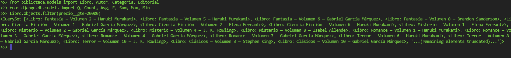

exclude()

Consulta: Mostrar los libros con stock diferente de 0.
```bash
Libro.objects.exclude(stock=0)
```

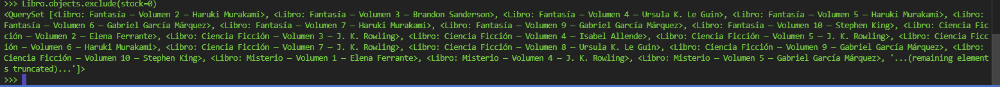

get()

Consulta: Buscar un libro por su ISBN.
```bash
Libro.objects.get(isbn="POE-01-001")
```


Si no existe, lanza DoesNotExist.
Si hay duplicados, lanza MultipleObjectsReturned.

annotate()

Consulta: Contar cuántos libros tiene cada autor.
```bash
Autor.objects.annotate(total_libros=Count("libros")).order_by("-total_libros")
```

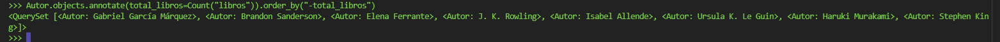 

## 3. Consultas con funciones de agregación
Promedio de precios por categoría
```bash
Categoria.objects.annotate(promedio_precio=Avg("libro__precio"))
```

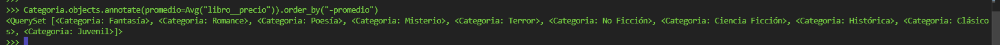 

Libro más caro y más barato
```bash
Libro.objects.aggregate(
    mas_caro=Max("precio"),
    mas_barato=Min("precio")
)
```

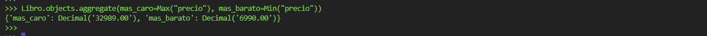 

Stock total disponible
```bash
Libro.objects.aggregate(total_stock=Sum("stock"))
```

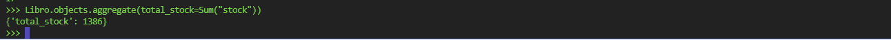 

## 4. Actualización masiva (update + F expressions)

Incrementar en 10% el precio de los libros de una categoría específica.
```bash
Libro.objects.filter(categorias__nombre="Poesía").update(precio=F("precio") * 1.1)
```

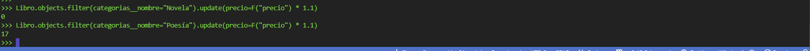 

## 5. Consultas personalizadas adicionales
Buscar libros por palabra clave
```bash
Libro.objects.filter(titulo__icontains="historia")
```

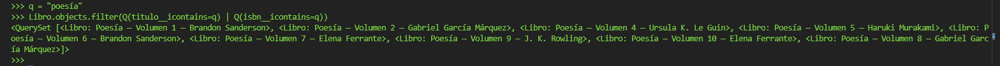 

Libros sin stock
```bash
Libro.objects.filter(stock=0)
```

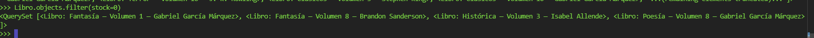 

Orden descendente por precio
```bash
Libro.objects.all().order_by("-precio")
```

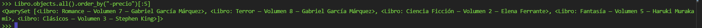 

Obtener 5 libros con mayor cantidad en stock
```bash
Libro.objects.order_by("-stock")[:5]
```

 

## 6. Uso de Relaciones

Ejemplo de relaciones entre modelos implementadas:

- Autor → Libro : Uno a muchos (ForeignKey)
- Libro → Categoria : Muchos a muchos (ManyToManyField)
- User → PerfilUsuario : Uno a uno (OneToOneField)

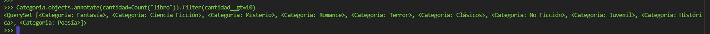

## 7. Consultas **SQL nativas** (connection.cursor)

A continuación, ejemplos de uso de SQL directo con `django.db.connection`:

Top 5 libros más caros

```bash
from django.db import connection
with connection.cursor() as cur:
    cur.execute("""
        SELECT titulo, precio
        FROM biblioteca_libro
        ORDER BY precio DESC
        LIMIT 5;
    """)
    print(cur.fetchall())
```
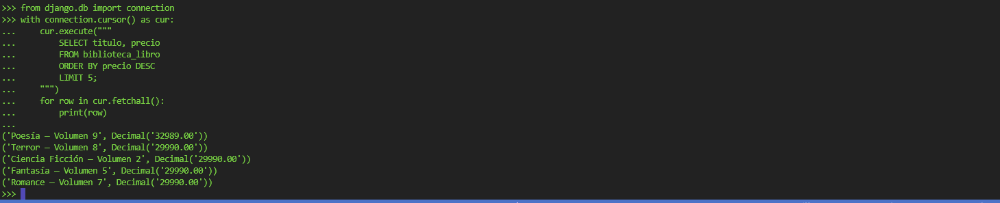

Promedio de precios por categoría
```bash
with connection.cursor() as cur:
    cur.execute("""
        SELECT c.nombre, AVG(l.precio)
        FROM biblioteca_categoria c
        JOIN biblioteca_libro_categorias lc ON c.id = lc.categoria_id
        JOIN biblioteca_libro l ON l.id = lc.libro_id
        GROUP BY c.nombre
        ORDER BY AVG(l.precio) DESC;
    """)
    print(cur.fetchall())
```
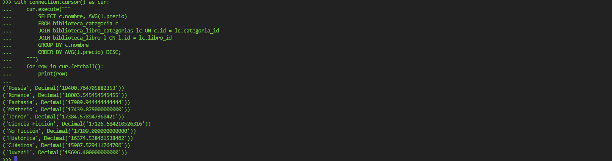

Cantidad de libros por autor
```bash
with connection.cursor() as cur:
    cur.execute("""
        SELECT a.nombre, COUNT(l.id)
        FROM biblioteca_autor a
        LEFT JOIN biblioteca_libro l ON a.id = l.autor_id
        GROUP BY a.nombre
        ORDER BY COUNT(l.id) DESC;
    """)
    print(cur.fetchall())

```
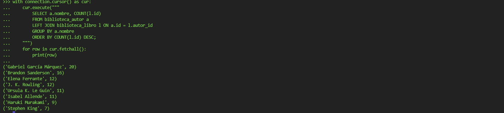

## 8. Conclusión

El proyecto “Librería” demuestra el uso completo del ORM de Django para:

- Conectar y gestionar bases de datos.
- Ejecutar operaciones CRUD.
- Realizar filtrados y consultas agregadas.
- Implementar relaciones 1–1, 1–N y N–N.
- Actualizar registros de forma masiva con expresiones F.
- Realizar consultas analíticas y personalizadas.

Todas las consultas se encuentran documentadas y respaldadas con capturas de pantalla en la carpeta /Capturas.

## Autor

Catalina Monserrat Villegas Ortega
Bootcamp Talento Digital — Módulo 7: Django y Bases de Datos
Año: 2025