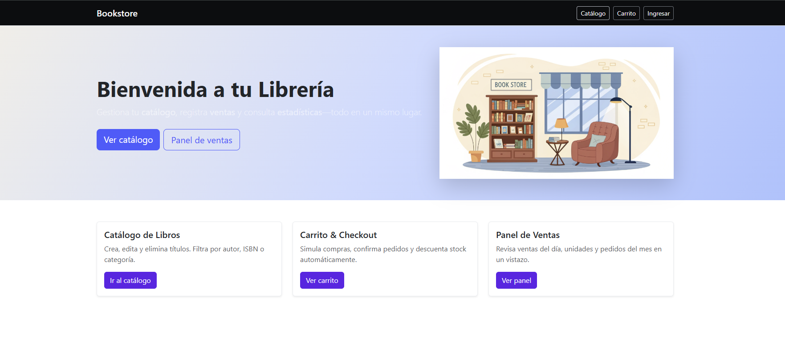
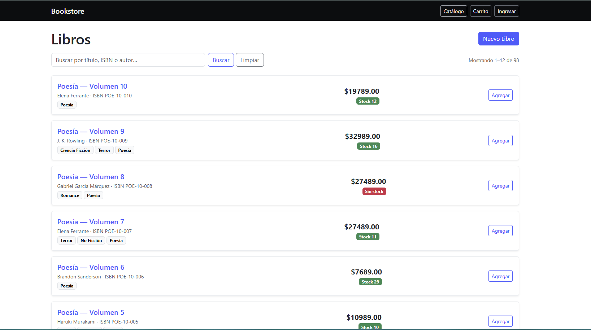
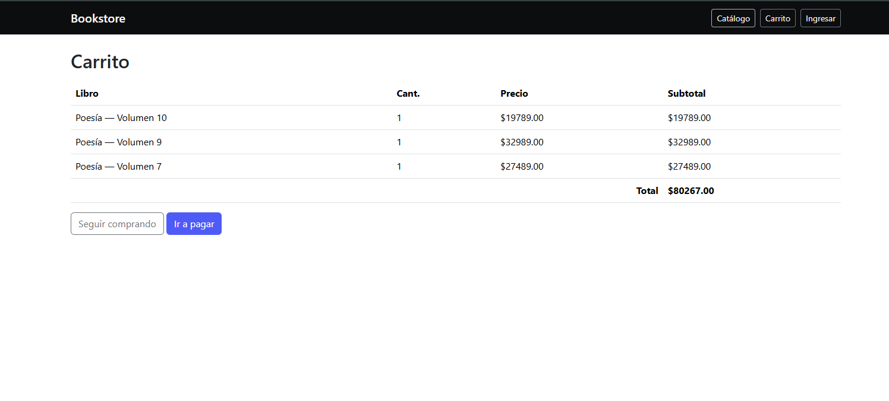
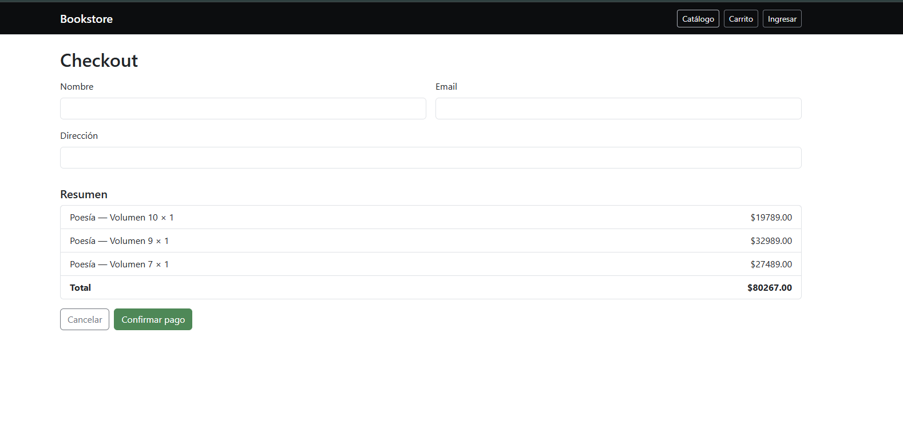
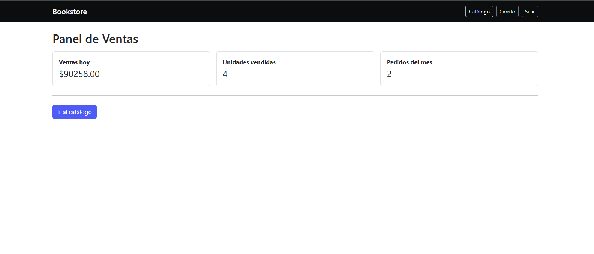
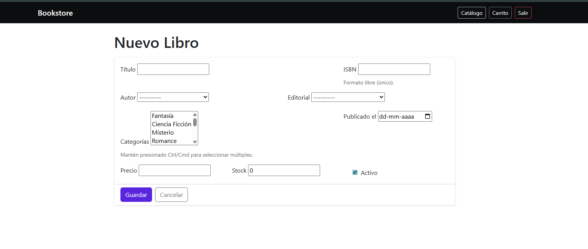
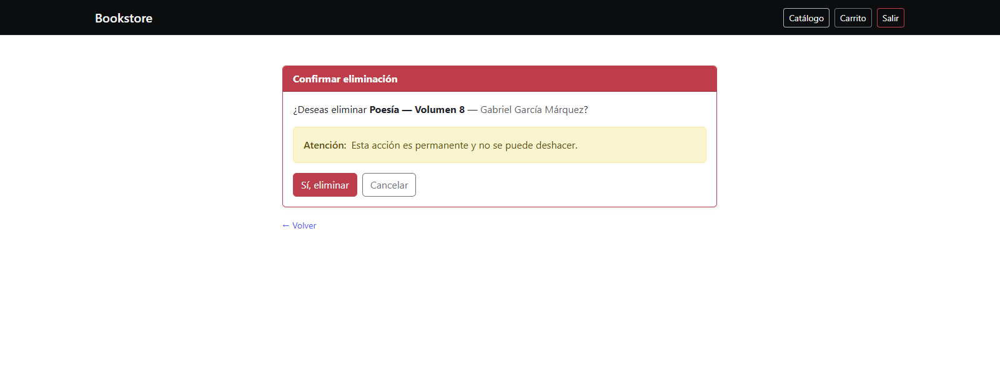
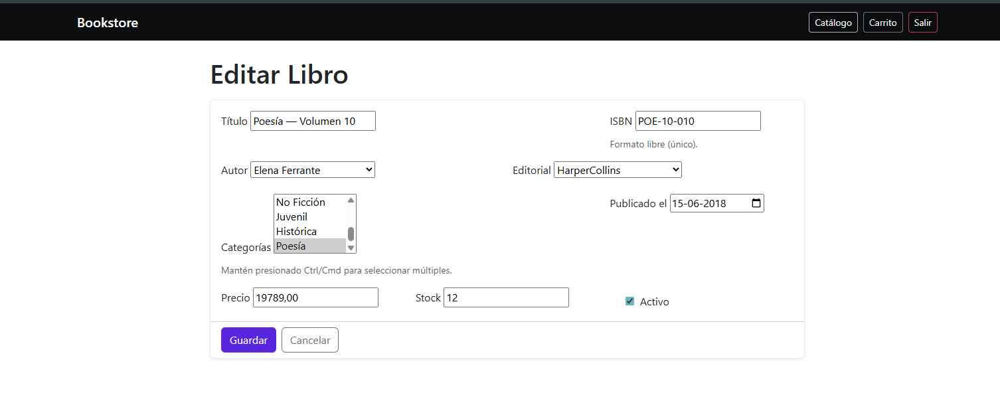
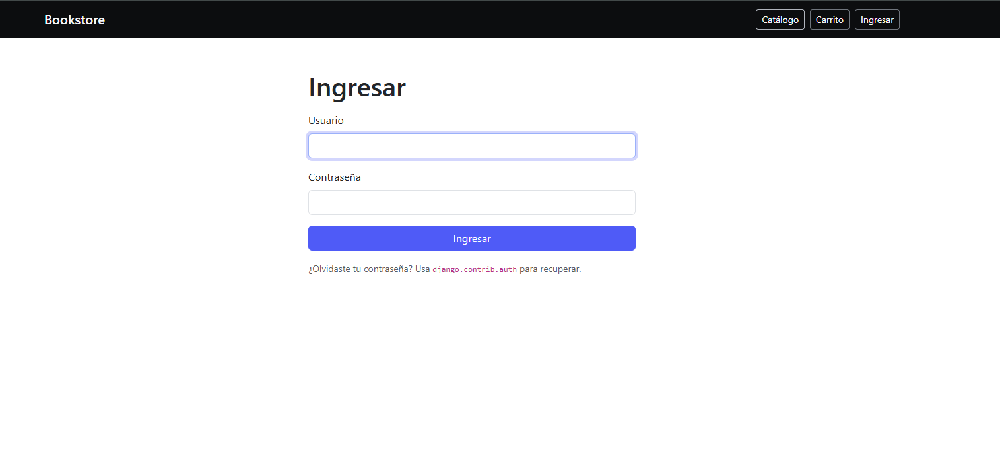
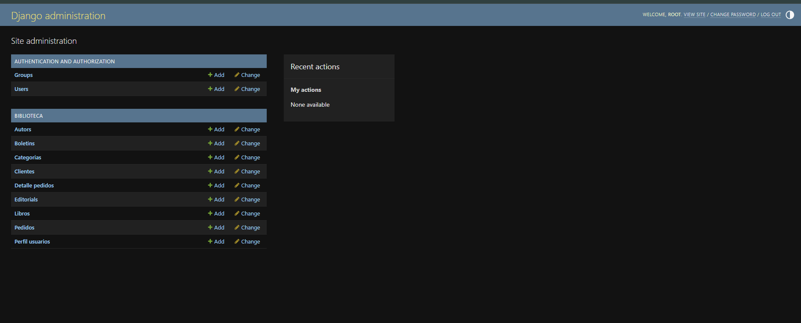

# Proyecto “Librería” 

— Evaluación de Portafolio M7 Aplicación web desarrollada con **Django** y **PostgreSQL** como parte de la evaluación final del **Módulo 7 – Talento Digital**. 

El proyecto demuestra el uso completo del **ORM de Django**, la integración con base de datos relacional, el manejo de relaciones (1–1, 1–N, N–N) y la implementación de consultas ORM y SQL personalizadas. 

--- 

## Tecnologías utilizadas 

- **Python 3.12+** 
- **Django 5.x** 
- **PostgreSQL 14+** 
- HTML5, Bootstrap 5 y CSS 
- Git y GitHub 

--- 

## Instalación y configuración del entorno 

1️⃣ Clonar el repositorio
```bash
git clone https://github.com/tu_usuario/libreria.git
cd libreria
```

2️⃣ Crear y activar entorno virtual
```bash
python -m venv myenv
myenv\Scripts\activate      # En Windows
source myenv/bin/activate   # En macOS/Linux
```

3️⃣ Instalar dependencias
```bash
pip install django psycopg2-binary
```

4️⃣ Configurar base de datos (PostgreSQL) Editar el archivo settings.py:
```bash
DATABASES = {
    'default': {
        'ENGINE': 'django.db.backends.postgresql',
        'NAME': 'libreria_db',
        'USER': 'postgres',
        'PASSWORD': 'tu_contraseña',
        'HOST': 'localhost',
        'PORT': '5432',
    }
}
```

### Otros motores soportados SQLite (modo desarrollo)
```bash
DATABASES = {
    'default': {
        'ENGINE': 'django.db.backends.sqlite3',
        'NAME': BASE_DIR / 'db.sqlite3',
    }
}
```
MySQL (modo alternativo)
```bash
DATABASES = {
    'default': {
        'ENGINE': 'django.db.backends.mysql',
        'NAME': 'libreria_db',
        'USER': 'root',
        'PASSWORD': 'tu_contraseña',
        'HOST': 'localhost',
        'PORT': '3306',
    }
}
```
Migraciones y ejecución del servidor
```bash
python manage.py makemigrations
python manage.py migrate
python manage.py createsuperuser
python manage.py runserver
```

Luego, ingresar a:
```bash
http://127.0.0.1:8000/
```

## Funcionalidades principales 

- CRUD completo para Libros 
- Autenticación de usuarios (login_required) 
- Panel de administración configurado (django.contrib.admin) 
- Relaciones: 
    - OneToOne: User ↔ PerfilUsuario 
    - ForeignKey (1–N): Autor → Libro, Cliente → Pedido 
    -ManyToMany (N–N): Libro ↔ Categoria 
- Entidad no relacionada: Boletin (independiente) 
- Consultas ORM: filter, exclude, get, annotate, agregaciones y F() 
- Consultas SQL nativas con connection.cursor() 
- Documentación y capturas en consultas_orm.md 

## Estructura del proyecto

```bash
Libreria/
│
├── biblioteca/
│   ├── migrations/
│   ├── templates/
│   ├── models.py
│   ├── views.py
│   ├── forms.py
│   ├── urls.py
│   └── admin.py
│
├── Capturas/
│   └── (imágenes de evidencia)
│
├── consultas_orm.md
├── manage.py
└── README.md
```

## Evaluación de criterios cumplidos 

| Requerimiento                                  | Estado | Evidencia                                      |
| ---------------------------------------------- | :----: | ---------------------------------------------- |
| Integración Django ↔ Base de datos             |    ✅   | `settings.py`, PostgreSQL configurado          |
| Entidad no relacionada                         |    ✅   | `Boletin` en `models.py`                       |
| Relaciones 1–1, 1–N, N–N                       |    ✅   | `PerfilUsuario`, `Autor`, `Libro`, `Categoria` |
| Migraciones ORM                                |    ✅   | Ejecutadas correctamente                       |
| Consultas ORM (filter, exclude, get, annotate) |    ✅   | `consultas_orm.md` + capturas                  |
| Consultas SQL nativas                          |    ✅   | Documentadas                                   |
| Aplicación MVC CRUD                            |    ✅   | `biblioteca/views.py`, plantillas HTML         |
| Documentación (README + .md)                   |    ✅   | Este archivo y `consultas_orm.md`              |


## Capturas del sitio web
- Página principal (Catálogo de libros)





- Carrito de compra y Checkout





- Panel de Ventas



- Formulario para agregar nuevo libro



- Edición y eliminación de registros





- Autenticación de usuarios



- Panel de administración



- Todas las imágenes se encuentran en la carpeta /Capturas.


## Autora 
- Catalina Monserrat Villegas Ortega 
- Bootcamp Talento Digital 
- Módulo 7: Django y Bases de Datos 
- Año: 2025